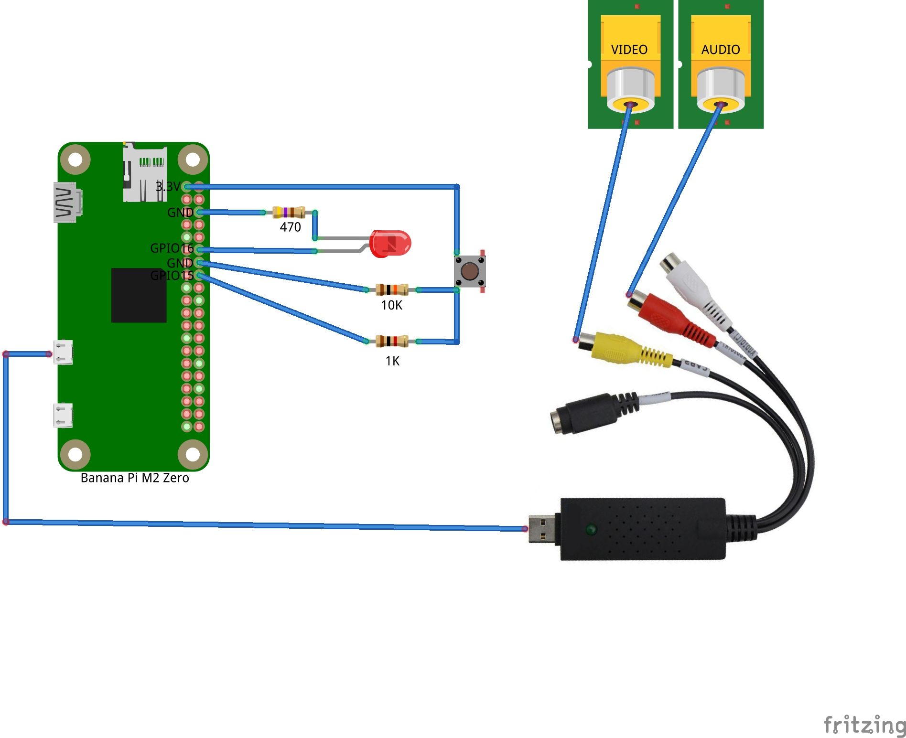
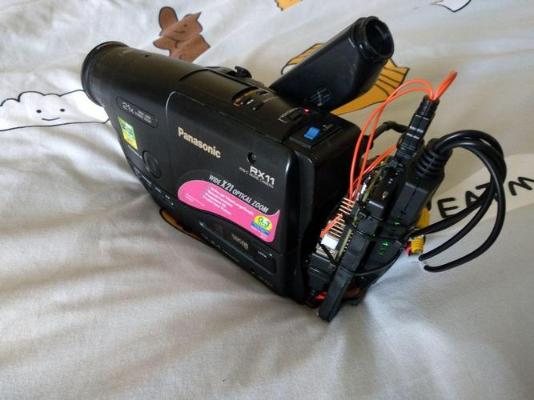
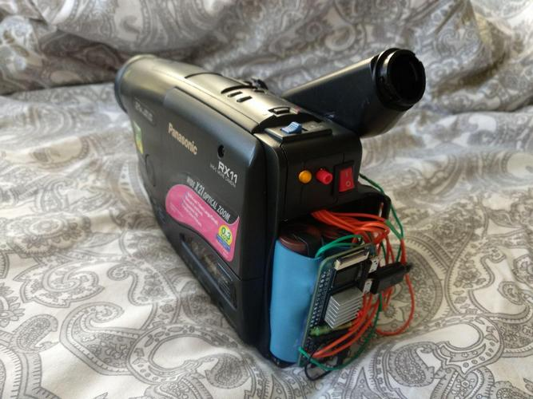
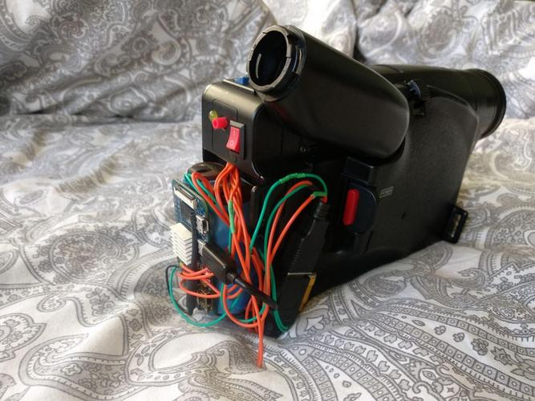

# cvbs-record
Скрипт для записи видео с платы захвата или веб камеры. Удобно использовать для записи с аналоговой камеры с платой оцифровки через мини ПК (в данном случае для примера используется banana pi, но можно использовать что вам нравится).
## Инструкция по установке
1. Скачиваем образ armbian https://www.armbian.com/bananapi-m2-zero. По идее не важно какой дистрибутив, но я использовал Bionic server.
1. Пишем образ на флешку через rufus.
1. Подключаемся к терминалу
1. Для настройки на плате нужен будет интернет, поэтому подключаемся к wifi через команду `nmtui` -> `Activate a connection`
1. Выключаем GUI (если он включен), чтобы он не расходовал ресурсы
`systemctl set-default multi-user.target`
1. Скачиваем скрипты
`git clone https://github.com/minbbb/cvbs-record.git`
1. Скачиваем ffmpeg
```
wget https://johnvansickle.com/ffmpeg/releases/ffmpeg-release-armhf-static.tar.xz
tar -xf ffmpeg-release-armhf-static.tar.xz
cp ffmpeg-X.X-armhf-static/ffmpeg cvbs-record/
cp ffmpeg-X.X-armhf-static/ffprobe cvbs-record/
```
1. Ставим nodejs
```
apt update
apt install nodejs
apt install npm
```
1. Переходим в директорию со скриптами
`cd cvbs-record`
1. Устанавливаем зависимости
`npm install`
1. На данном этапе уже можно вручную запустить скрипт и посмотреть как оно работает
`node record.js`
1. Исправляем в файле сервиса record.service путь до скрипта в параметре **ExecStart** и путь до директории в параметре **WorkingDirectory**. Можно это сделать к примеру через `nano record.service`
1. Копируем файл сервиса record.service в директорию /etc/systemd/system
`cp record.service /etc/systemd/system/ `
1. Включаем сервис
`systemctl enable record.service`
1. Если хотите сразу запустить скрипт, то выполняем
`systemctl start record.service`
Или можно перезапустить плату и скрипт уже сам запустится
1. При необходимости можно немного настроить скрипт через файл **config.json**. Там можно найти путь куда сохранять видео, вкл/выкл логирование, вкл/выкл автозапись при включении, выбор видеоисточника(умеет автоматически определять) и выбор аудиоисточника.
1. Настраиваем wifi точку для доступа к веб-интерфейсу платы вне доступа домашней wifi сети. Для этого нужен непрерывный доступ к терминалу, поэтому если подключены к плате через встроенный wifi, подключайтесь как-то по другому чтобы настроить.
`armbian-config` -> `network` -> `hotspot`
1. Должна появиться wifi точка с названием **ARMBIAN**. Перезагружаемся если точка не появилась
`reboot`
1. После запуска точки настраиваем под себя имя точки и пароль `armbian-config` -> `network` -> `hotspot` -> `edit` -> `basic`
1. После подключения к wifi точке можно присоединиться к плате по адресу 172.24.1.1 (по умолчанию такой, можно поменять если хочется)
1. Может так случиться что после запуска точки не будет работать dhcp при подключении к ней. Это можно попробовать решить 2-мя способами:
	- Задать на устройстве с которого подключаетесь статику в подсети 172.24.1.*
	- Просто переподнять точку
1. Открываем в браузере адрес http://172.24.1.1 и видим интерфейс управления.
1. Если запись будет подлагивать, то меняем **governor** ядра на **performance** через `armbian-config` -> `System` -> `CPU` -> выбираем максимальную и минимальную частоту -> Выбираем `performance`

## Управление с помощью кнопки (GPIO)
При нажатии на кнопку будет происходить запуск или остановка записи, в зависимости от того какое сейчас состояние.

Индикатор мерцает с частотой в 1000 мс - камера в режиме ожидания  
Индикатор мерцает с частотой в 50 мс - происходит запуск записи  
Индикатор мерцает с частотой в 200 мс - происходит запись видео  

## Схема


## Прототипы
С применением Orange Pi Zero



С применением Banana Pi BPI-M2 ZERO

